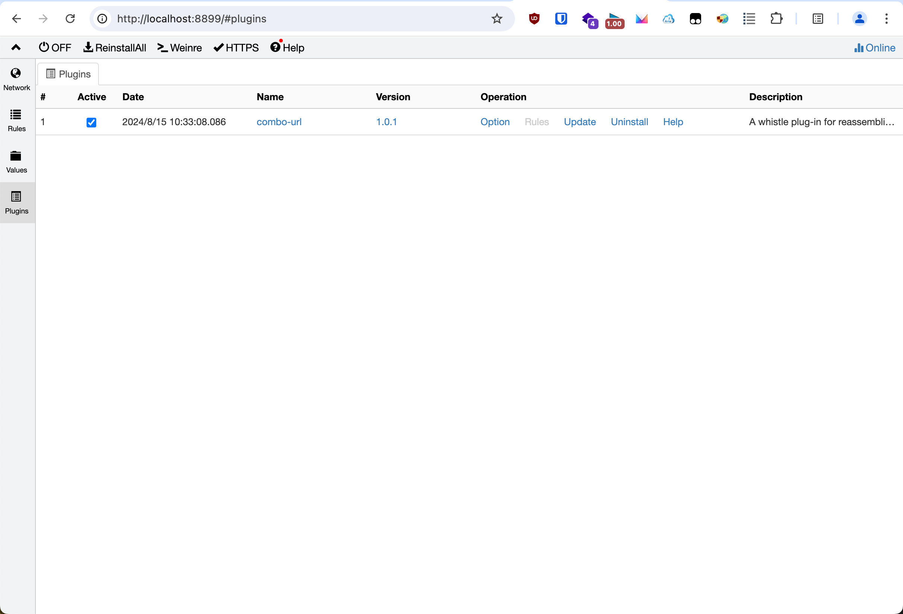

## TL;DR;
[whistle.combo-url](https://github.com/eric-gitta-moore/whistle.combo-url) 是最终的成品插件，可以根据 README 提示上手使用一下

~~~yaml
# sample 1, for https://www.taobao.com/
# sourceURL: https://d.alicdn.com/alilog/??aplus/1.13.5/aplus_pc.js,aplus/1.13.5/plugin/aplus_spmact.js?v=20240718161046
# target:
#   - aplus/1.13.5/aplus_pc.js -> not modified
#   - aplus/1.13.5/plugin/aplus_spmact.js -> https://d.alicdn.com/alilog/aplus/1.13.2/plugin/aplus_spmact.js

/.+.(ali)cdn.com/i combo-url://{com-yaml} resCors://*
```com-yaml
mapping:
  /aplus/1.13.5/plugin/aplus_spmact.js/i: https://d.alicdn.com/alilog/aplus/1.13.2/plugin/aplus_spmact.js
```
~~~


## Whistle 介绍
Whistle 是基于 Node 实现的跨平台抓包调试工具

官网：https://github.com/avwo/whistle


## 问题引入
用过 Whistle 的老师应该都知道，反代某个资源或者是 mock 某个请求，又或是正则替换都非常方便。使用 DLS 声明规则就行了

但如果是 combo 类型的资源，那就会有点棘手了。我们希望只替换其中某个 js，其他的依旧请求源站获取。

如果 Google 搜索一下会发现有两个比较好的工具可以实现，一个是 Whistle 配套插件 [whistle.combo](https://github.com/whistle-plugins/whistle.combo)，另一个是 [flex-combo](https://github.com/wayfind/flex-combo)


但是两个插件都是在本地找具体的问题，现在前端开发更多是开启一个 `live server`，此时我们希望能够从我们指定的 url 获取 js 资源。并且最好能够按照我们指定的正则表达式匹配。

简而言之，例如把 `http://i.cdn.com/??x.js,y.js,z.js`

替换成

- `http://i.cdn.com/x.js`
- `https://baidu.com/y.js`
- `https://google.com/z.js`

上面三个文件的组合

这种情况咱们可以借助 Whistle 插件的能力，在 `request` 请求前后进行拦截，手动拆分、获取、组合实现这样的需求


## 插件系统
接下来重点介绍 Whistle 的插件系统以及实践

为了满足一些特定业务场景的需要，whistle 提供了插件扩展能力，通过插件可以新增 whistle 的协议实现更复杂的操作、也可以用来存储或监控指定请求、集成业务本地开发调试环境等等，基本上可以做任何你想做的事情，且开发、发布及安装 whistle 插件也都很简单。

whistle的插件就是一个Node模块，名字必须为 `whistle.your-plugin-name` 或 `@org/whistle.your-plugin-name`，其中 `your-plugin-name` 为插件名称，只能包含 `小写字母(a-z)`、`数字(0-9)`、`_`、`-` 四种字符


可以在 whistle 的插件列表看到：


### 实现原理
whistle 的插件是一个独立运行的进程，这样是为了确保插件不会影响到 whistle 主进程的稳定性，并通过暴露一些 http server 的方式实现与 whistle 的交互，whistle 会在特定阶段请求特定的server，具体看下面的原理图：

> 这里的 server 指的是 Whistle 插件系统中的钩子，而不是 HTTP sever 或者 Sevlet 等


再鸟瞰一下一个完整插件所有的文件和钩子

```
❯ tree                                         
.
├── lib
│   ├── auth.js
│   ├── reqRead.js
│   ├── reqWrite.js
│   ├── resRead.js
│   ├── resRulesServer.js
│   ├── resStatsServer.js
│   ├── resWrite.js
│   ├── rulesServer.js
│   ├── server.js
│   ├── sniCallback.js
│   ├── statsServer.js
│   ├── tunnelReqRead.js
│   ├── tunnelReqWrite.js
│   ├── tunnelResRead.js
│   ├── tunnelResWrite.js
│   ├── tunnelRulesServer.js
│   ├── uiServer
│   │   ├── index.js
│   │   └── router.js
│   ├── wsReqRead.js
│   ├── wsReqWrite.js
│   ├── wsResRead.js
│   └── wsResWrite.js
└── package.json

3 directories, 23 files
```

其实可以理解为文件名和图中的钩子节点是一致的，具体文件里面还有个每个钩子事件

例如最常用的 `server`

```js
module.exports = (server, options) => {
  // handle http request
  server.on('request', (req, res) => {
    // do something
    req.passThrough();
  });

  // handle websocket request
  server.on('upgrade', (req, socket) => {
    // do something
    req.passThrough();
  });

  // handle tunnel request
  server.on('connect', (req, socket) => {
    // do something
    req.passThrough();
  });
};
```

这样应该就非常好理解了。我们只需要拦截 `server` 钩子的 `request` 事件就行了。

在里面我们拿到 `req` 的 url，拆分，然后挨个匹配规则，接着挨个请求，最后用 `Buffer` 合并一起返回给 `res` 就行了

### 实战编写
建立 npm 包，初始化等就不再赘述


#### 初始化项目
先导出 `server` 钩子

```js
// whistle.combo-url/index.js
exports.server = require('./lib/server');
```

在 `whistle.combo-url/lib/server.js` 复制 `server` 钩子实现模版

我们只需要处理 http(s) 请求，只需要 `request` 事件

```js
// whistle.combo-url/lib/server.js
module.exports = (server, options) => {
  server.on('request', (req, res) => {
    req.passThrough(); // 直接放行
  });
};
```


#### 定义数据结构
我们以开头定义的配置为例

~~~yaml
# sample 1, for https://www.taobao.com/
# sourceURL: https://d.alicdn.com/alilog/??aplus/1.13.5/aplus_pc.js,aplus/1.13.5/plugin/aplus_spmact.js?v=20240718161046
# target:
#   - aplus/1.13.5/aplus_pc.js -> not modified
#   - aplus/1.13.5/plugin/aplus_spmact.js -> https://d.alicdn.com/alilog/aplus/1.13.2/plugin/aplus_spmact.js

/.+.(ali)cdn.com/i combo-url://{com-yaml} resCors://*
```com-yaml
mapping:
  /aplus/1.13.5/plugin/aplus_spmact.js/i: https://d.alicdn.com/alilog/aplus/1.13.2/plugin/aplus_spmact.js
```
~~~

配置 yaml
```yaml
mapping:
  /aplus/1.13.5/plugin/aplus_spmact.js/i: https://d.alicdn.com/alilog/aplus/1.13.2/plugin/aplus_spmact.js
```

那么 yaml 转 json 出来就是

```json
{
  "mapping": {
    "/aplus/1.13.5/plugin/aplus_spmact.js/i": "https://d.alicdn.com/alilog/aplus/1.13.2/plugin/aplus_spmact.js"
  }
}
```

可以看到正则很好的被识别了出来，不需要使用者额外加转义了

#### 解析配置文件 & 解析并应用映射规则
解析 YAML 依赖 `yaml` 这个库，需要手动安装一下 `npm i -g yaml`

```js
// whistle.combo-url/lib/server.js
const YAML = require("yaml");

// 解开 combo url 变成单个文件
// delimiter 是界定符，默认是 ??
// separator 是文件分隔符，默认是 ,
function unfoldUrlCombo({ delimiter, separator, url }) {
  const urlParsed = new URL(url);
  const prefix = `${urlParsed.origin}${urlParsed.pathname}`;
  return urlParsed.search
    .slice(2)
    .split(",")
    .map((e) => `${prefix}${e}`);
}

module.exports = (server, options) => {
  server.on('request', (req, res) => {

    const ruleValue = YAML.parse(
      // 其中 `options.RULE_VALUE_HEADER` 就是一个键的常量
      decodeURIComponent(req.headers[options.RULE_VALUE_HEADER]),
      // 通过 `req.headers[options.RULE_VALUE_HEADER]` 可以把用户在 `Rules` 页面的配置拿到，拿到的结果是 URLEncode 之后的，这里还需要解码一下
    );

    const rewriteList = unfoldUrlCombo({
      url: req.fullUrl, // 请求完整的 URL
      delimiter: '??',
      separator: ',',
    }).map((curUrl) => {
      for (const regex in finalRule.mapping) {
        // e.g. regex === /aplus/1.13.5/plugin/aplus_spmact.js/i
        // 找到前正则界定符，/aplus/1.13.5/plugin/aplus_spmact.js/i
        //                ⌃
        const regRaw = regex.slice(1, regex.lastIndexOf("/")); 
        // 找到后正则界定符号，、aplus/1.13.5/plugin/aplus_spmact.js/i
        //                                                      ⌃
        const modifier = regex.slice(regex.lastIndexOf("/") + 1);
        // 构建正则，测试是否匹配 URL
        if (new RegExp(regRaw, modifier).test(curUrl)) {
          // 如果匹配的话用给定配置换掉 URL
          return finalRule.mapping[regex];
        }
      }
      // 用原 URL
      return curUrl;
    });

    req.passThrough(); // 直接放行
  });
};
```


#### 获取 combo 资源 & 拼接 Buffer

```js
module.exports = function (server, options) {
  server.on("request", async (req, res) => {
    // const ruleValue = ...
    // const rewriteList = ...
    // ...

    /**
     * @type {Uint8Array[]}
     */
    const comboBuffer = Array.from({ length: rewriteList.length });
    const tasks = rewriteList.map(async (e, idx) => {
      // 挨个请求数据拿到 buffer （其实也可以合并一下没有被替换掉，但是会麻烦一点，需要保持被替换的 js 在返回结果中的上下位置不变）
      const data = await fetch(e).then((e) => e.arrayBuffer());
      comboBuffer[idx] = new Uint8Array(data);
    });
    await Promise.all(tasks);

    // ...
    req.passThrough(); // 直接放行
  });
};
```

#### 构造响应 & 返回数据


```js

module.exports = function (server, options) {
  server.on("request", async (req, res) => {
    // const ruleValue = ...
    // const rewriteList = ...
    // const comboBuffer = ...
    // ...

    const client = req.request((svrRes) => {
      // 长度有变，直接删除
      delete svrRes.headers["content-length"];
      // 目前的 comboBuffer 是没有 gzip 压缩过，删除服务端下发的压缩编码
      delete svrRes.headers["content-encoding"];
      // 写请求头
      res.writeHead(
        finalRule.resStatusCode,
        Object.assign({}, svrRes.headers, finalRule.OverrideResHeaders),
      );
      // 发送 buffer
      res.end(Buffer.concat(comboBuffer));
    });
    // 处理请求，必须。不然请求方的 socket 会被挂起
    req.pipe(client);

    // req.passThrough(); // 直接放行
  });
};
```
到目前为止，整个插件的功能已经完成了。


#### 测试
可以在插件项目根目录下面运行 `w2 run`，这个时候会自动读取当前目录下的插件



命中，在检查一下返回的数据，确实被替换了


完结


