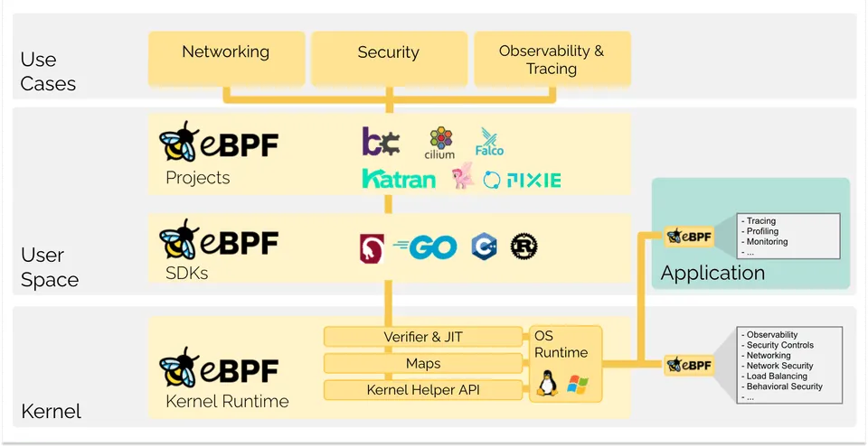
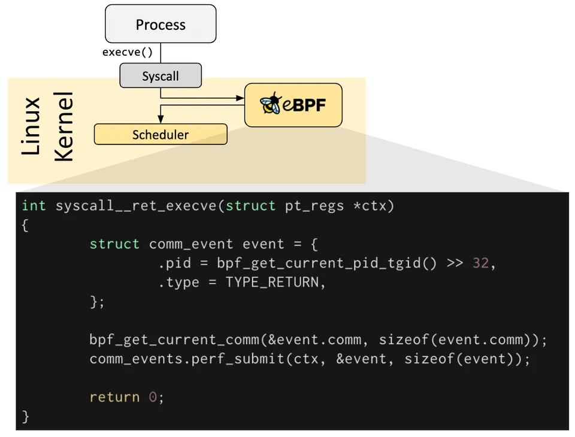
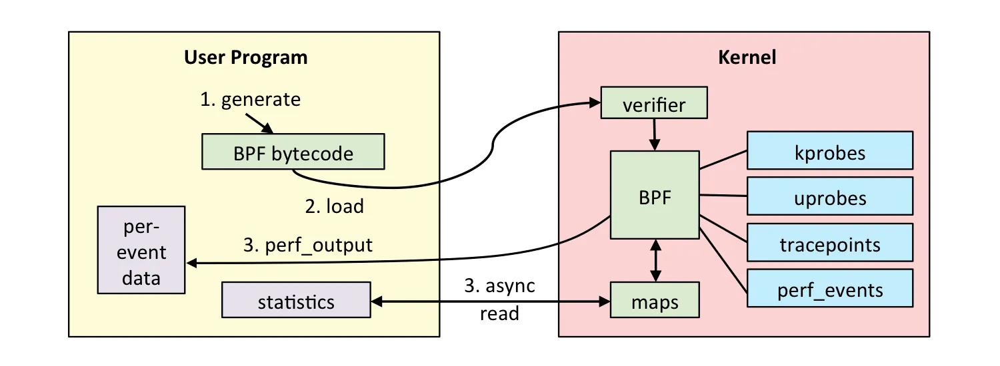
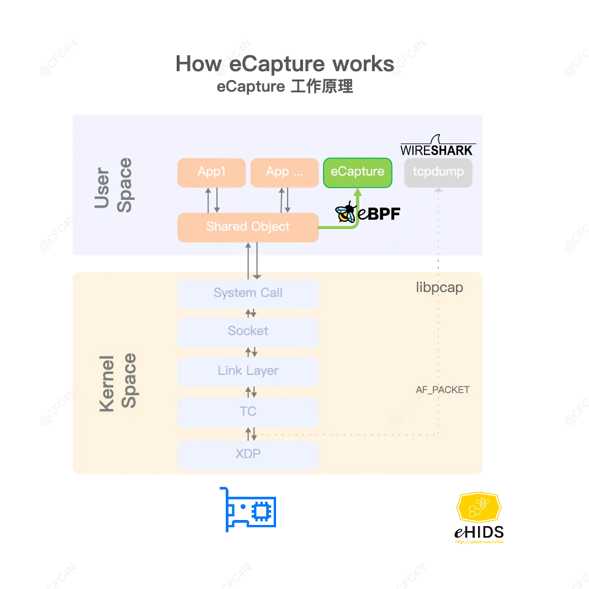
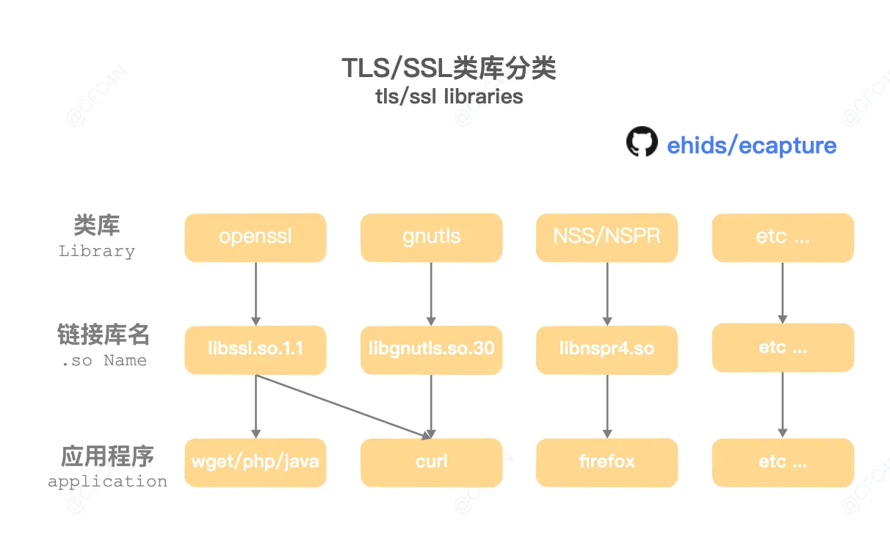
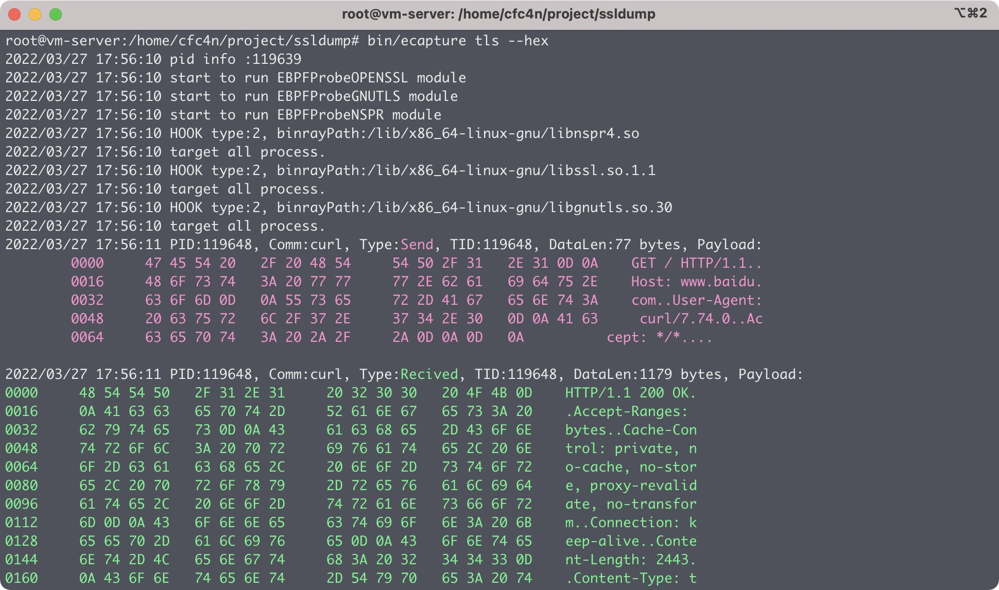

## 介绍

eBPF Uprobe/Traffic Control实现的各种用户空间/内核空间的数据捕获，无需改动原程序。
- SSL/HTTPS数据导出功能，针对HTTPS的数据包抓取，不需要导入CA证书。
- 支持go tls类库的明文捕获，即使用golang语言编写的https/tls程序的加密通讯。
- bash的命令捕获，HIDS的bash命令监控解决方案。
- mysql query等数据库的数据库审计解决方案。


## eBPF 介绍 & 入门

eBPF 是一种可以在特权上下文（例如操作系统内核）中运行程序的技术。它是 Linux 中 Berkeley Packet Filter 过滤机制的继承者，也用于 Linux 内核的非网络部分。 它用于在运行时安全有效地扩展内核的功能，而无需更改内核源代码或加载内核模块。



下面以一个 Hook 内核函数 execve 简单的示例，从使用层面理解 eBPF 的魅力



> **execve**:
>
> 在父进程中 `fork` 一个子进程，在子进程中调用exec函数启动新的程序。`exec` 函数一共有六个，其中 `execve` 为内核级系统调用，其他（execl，execle，execlp，execv，execvp）都是调用 execve 的库函数。
>
> **函数定义**: 
> 
> `int execve(const char *filename, char *const argv[ ], char *const envp[ ]);`
>
> **返回值**: 函数执行成功时没有返回值，执行失败时的返回值为-1.
>
> **函数说明**: `execve()` 用来执行参数 `filename` 字符串所代表的文件路径，第二个参数是利用数组指针来传递给执行文件，并且需要以空指针(NULL)结束，最后一个参数则为传递给执行文件的新环境变量数组。
>


Kernel Space:
```cpp
#include <linux/sched.h>

// 定义输出数据结构
struct data_t {
    u32 pid;                  // 进程 ID
    u64 ts;                   // 时间戳
    char comm[TASK_COMM_LEN]; // 进程 commandline
};

// 定义 BPF 性能输出映射
BPF_PERF_OUTPUT(events);

// 当 execve 系统调用返回时捕获事件
int syscall__ret_execve(struct pt_regs *ctx) {
    struct data_t data = {}; // 声明并初始化输出数据结构

    // 获取当前进程的 PID 和 TGID
    // 返回低32位的进程ID(内核视图的PID，在用户空间中通常表示为线程ID)
    // 和高32位的线程组ID(用户空间通常认为是PID)。
    // 通过直接将其设置为u32，丢弃了上面的32位。
    data.pid = bpf_get_current_pid_tgid();
    // u64纳秒数。在系统启动时启动，但在挂起期间停止。
    data.ts = bpf_ktime_get_ns();
    // 获取当前进程的 commandline
    bpf_get_current_comm(&data.comm, sizeof(data.comm));

    // 提交事件到用户态
    events.perf_submit(ctx, &data, sizeof(data));

    return 0; // 返回 0 表示成功
}
```


User Space:
```python
from bcc import BPF
from bcc.utils import printb

# define BPF program
prog = """
#include <linux/sched.h>

// define output data structure in C
struct data_t {
    u32 pid;
    u64 ts;
    char comm[TASK_COMM_LEN];
};
BPF_PERF_OUTPUT(events);

int syscall__ret_execve(struct pt_regs *ctx) {
    struct data_t data = {};

    data.pid = bpf_get_current_pid_tgid();
    data.ts = bpf_ktime_get_ns();
    bpf_get_current_comm(&data.comm, sizeof(data.comm));

    events.perf_submit(ctx, &data, sizeof(data));

    return 0;
}
"""

# load BPF program
b = BPF(text=prog)
k = b.get_syscall_fnname("ret_execve")
# attach 到内核探针
b.attach_kprobe(event=k, fn_name="syscall__ret_execve")

# =========== 后面不重要了，都是输出
# header
print("%-18s %-16s %-6s %s" % ("TIME(s)", "COMM", "PID", "MESSAGE"))

# process event
start = 0
def print_event(cpu, data, size):
    global start
    event = b["events"].event(data)
    if start == 0:
            start = event.ts
    time_s = (float(event.ts - start)) / 1000000000
    printb(b"%-18.9f %-16s %-6d %s" % (time_s, event.comm, event.pid,
        b"Hello, perf_output!"))

# loop with callback to print_event
b["events"].open_perf_buffer(print_event)
while 1:
    try:
        b.perf_buffer_poll()
    except KeyboardInterrupt:
        exit()
```

了解了大概的使用之后，再理解一下 eBPF 程序加载流程会更加顺畅




1. 使用 C 语言开发一个 eBPF 程序；
2. 借助 LLVM 把 eBPF 程序编译成 BPF 字节码；
3. 通过 bpf 系统调用，把 BPF 字节码提交给内核；
4. 内核验证并运行 BPF 字节码，并把相应的状态保存到 BPF maps 中；
5. 用户程序通过 BPF maps 查询 BPF 字节码的运行状态。


## eCapture 原理

了解了 eBPF 之后再来看看 eCapture 原理，实际上就是 Hook 不同的库中不同的函数，组合起来，实现既定的功能

大家可以先对下面这张图有个大概的印象，接下来咱们一步步拆解



如工作原理的图所示（图没那么细），在用户态的加解密函数中下钩子。 tcpdump(libpcap) 是在数据包接收到，XDP (eXpress Data Path，快速数据路径，XDP 是一种基于eBPF的高性能数据路径，用于绕过大多数操作系统网络堆栈来高速发送和接收网络数据包) 处理后，进行 clone packet，进行包的复制，发送给用户态进程。二者工作的所在层不一样。

重点其实在于 加解密函数，也就是 opensssl 等 tls/ssl 加密库

其中 eCapture tls 支持了三类 tls/ssl 加密类库，分别是

- `openssl` ，动态链接库名字为 `libssl.so`
- `gnutls` ，动态链接库名字为 `libgnutls.so`
- `nss/nspr` ，动态链接库名字为 `libnspr4.so`



到这里，其实如果启动一次程序，大家看日志，大概就会对整体有一个比较清楚的认识了

`./ecapture tls --hex`



可以看到 `HOOK type:2,binrayPath:/lib/x86_64-linux-gnu/libnspr4.so`

所以其实理解起来还是 ok 的，一是在加密的时候做手脚获取信息，二是在发送包的时候做手脚拿到数据包，二者相结合就能够解出来原始数据包了

基于同样的原理 eCapture 也能够实现 mysql query等数据库的数据库审计解决方案

其实就是 Hook 大法，找到执行 sql 命令的函数，Hook 一下就能拿到入参了（其实和 Java 中的 Hook 工具都差不多，Xposed 也比较类似）

mysqld模块，核心原理是HOOK了 `dispatch_command` 函数，
- 第一个参数为 CMD 类型，值为 `COM_QUERY` 时，为查询场景，即审计需求的查询类型。
- 第二个参数是 THD 的结构体
- 第三个是查询的 SQL 语句
- 第四个参数是 SQL 语句的长度，

```cpp
// https://github.com/MariaDB/server/blob/b5852ffbeebc3000982988383daeefb0549e058a/sql/sql_parse.h#L112
dispatch_command_return dispatch_command(
        enum enum_server_command command, 
        THD *thd,
        char* packet, 
        uint packet_length, 
        bool blocking = true);
```