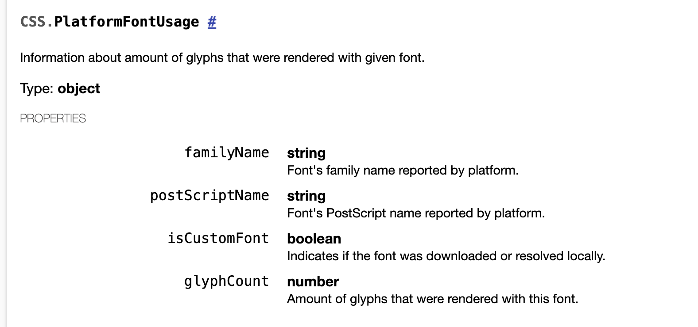
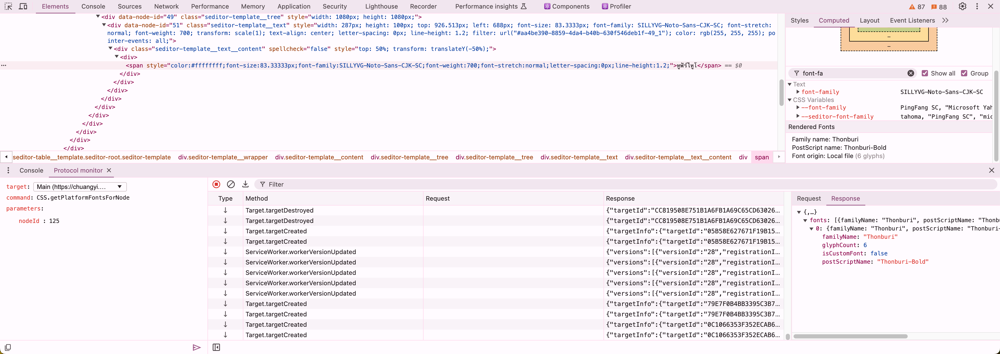

## 目的


## 尝试方式

### 计算样式 getComputedStyle
> ref: https://stackoverflow.com/a/7444724

```js
function css( element, property ) {
    return window.getComputedStyle( element, null ).getPropertyValue( property );
}
// test
css($0, 'font-family')
```

只能获取到计算后的 font-family 有哪些，并无法得知实际使用的字体


### FontFaceSet.prototype.check
> mdn: https://developer.mozilla.org/zh-CN/docs/Web/API/FontFaceSet/check
>
> FontFaceSet 的check()方法会返回是否在给定的字体列表中的所有字体已经被加载并可用。

实现 & 使用

> ref: https://stackoverflow.com/a/75228391

```js
const getRenderedFontFamilyName = ( element ) => {
    // Font families set in CSS for the element
    const fontFamilies = window.getComputedStyle( element, null ).getPropertyValue( "font-family" );
    // const hardcodedFamilies = '-apple-system, BlinkMacSystemFont, "Segoe UI Adjusted", "Segoe UI", "Liberation Sans", sans-serif';
    
    // Remove the " sign from names (font families with spaces in their names) and split names to the array
    const fontFamiliesArr = fontFamilies.replaceAll('"', "").split(", ");

    // Find the first loaded font from the array
    return fontFamiliesArr.find( e => document.fonts.check( `12px ${e}`) );
}
// test
getRenderedFontFamilyName($0);
```

更进一步，这个 api 可以知道字体在整个 document 里面是否可用，但是并不一定是生效的那个字体


### Canvas 绘制+逐字对比
> stack overflow: https://stackoverflow.com/a/38910481

实际上本质就是先拿到计算字体族然后再用 monospace 字体作为 fallback，

接着挨个字体去绘制，如果碰到哪次绘制和上一次不一样，那么本次使用的字体就是 rendered font

问题是很多字体其实有些字是挺类似的，这个误判率还挺高，也不适合频繁获取的场景

具体实现：
```js
function renderedfont(ele) {
    var getDefaultFonts = function () {
        var iframe = document.createElement('iframe');
        var html = '<html><body>';
        var fonts;
        document.body.appendChild(iframe);
        iframe.contentWindow.document.open();
        iframe.contentWindow.document.write(html);
        var subele = iframe.contentWindow.document.createElement(ele.tagName);
        iframe.contentWindow.document.body.appendChild(subele);
        fonts = getComputedStyle(subele)['font-family'];
        document.body.removeChild(iframe);
        return fonts;
    }
    var fonts = getComputedStyle(ele)['font-family'] + ',' + getDefaultFonts();
    var fontsArray = fonts.split(',');
    var canvas = document.createElement('canvas');
    var ctx = canvas.getContext("2d");
    var testString = "abcdefghijklmnopqrstuvwxyz!@#$%^&*()ñ";
    var prevImageData;
    document.body.appendChild(canvas);
    canvas.width = 500;
    canvas.height = 300;
    fontsArray.unshift('"Font That Doesnt Exists ' + Math.random() + '"');

    for (var i = 0; i < fontsArray.length; i++) {
        var fontName = fontsArray[i].trim();
        ctx.clearRect(0, 0, canvas.width, canvas.height);
        ctx.font = '16px ' + fontName + ', monospace';
        ctx.fillText(testString, 10, 100);
        var idata = ctx.getImageData(0, 0, canvas.width, canvas.height); 
        var data = idata.data
        if (prevImageData) {
            for (var j = 0; j < data.length; j += 3) {
                if (prevImageData[j + 3] !== data[j + 3]) {
                    document.body.removeChild(canvas);
                    return fontName;
                }
            }
        }
        prevImageData = data;
    }

    document.body.removeChild(canvas);
    return 'monospace';
}
// test
renderedfont($0)
```

### Chrome DevTools Protocol
这里我们换一个思路，既然控制台能够看到 rendered font，也可以从这里下手。只不过使用 cdp 实现的要派上用场会有点麻烦，用户不一定安装我们自己写的浏览器插件


打开 DevTools 的实验性选项 `Protocol Monitor`，在 `Elements` tab 选中元素的时候发现会请求一个带有 font 字样的 cdp api `getPlatformFontsForNode`

经过查阅 [cdp](https://chromedevtools.github.io/devtools-protocol/) 的 api 发现 `CSS.getPlatformFontsForNode` 确实可以获取到 rendered fonts，而且还能够区分是本地字体还是网络字体



api 的返回结果是 `array[ PlatformFontUsage ]`

其中又一个键是 `isCustomFont`，表示 表示字体是否已下载或已在本地解析

> isCustomFont: Indicates if the font was downloaded or resolved locally.


所以流程大概如下：

1、DOM.getDocument 拿到 document nodeId

2、DOM.querySelector + doc nodeId + CSS Selector 选中目标元素 拿到 Element nodeId

3、CSS.getPlatformFontsForNode + Element nodeId 拿到 Array<PlatformFontUsage>

4、PlatformFontUsage.isCustomFont：Indicates if the font was downloaded or resolved locally.



## 结论
1、计算样式，只能获取设置的字体，无法获取实际渲染字体 ❌
2、FontFaceSet.prototype.check 可以检测字体是否在 document 可用，但是不一定是 rendered font ❌
3、canvas 逐字判定 容错率太低，可能识别错误，且性能不太行 ❌
4、CDP 实现，完美获取，性能优异，但是需要额外开发浏览器插件，且用户路径较长

## 参考
- https://stackoverflow.com/questions/57853292/how-to-get-the-rendered-font-in-javascript
- https://stackoverflow.com/questions/7444451/how-to-get-the-actual-rendered-font-when-its-not-defined-in-css