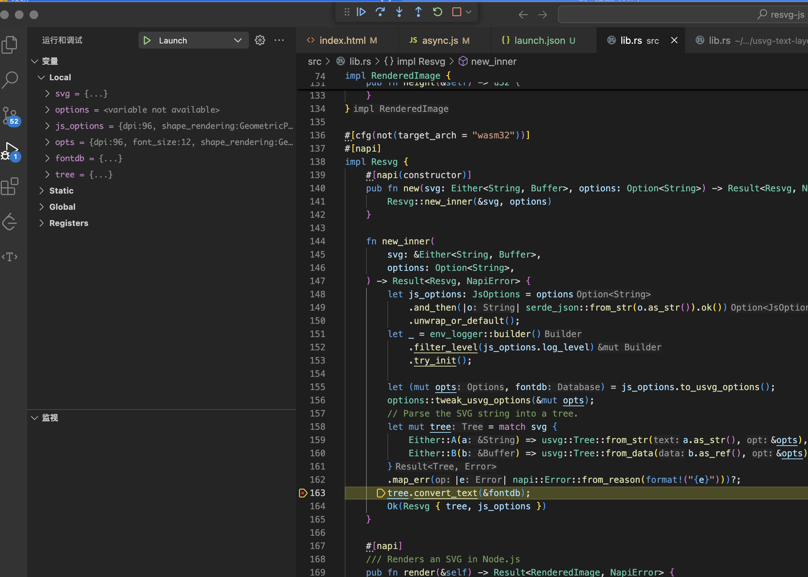

## 背景
出于需要，开发中碰到后端渲染的 svg 和 chrome 渲染出来的结果在字体上有出入，随深入查看源码分析 + debugger

于是乎，希望在 js 执行[这个文件](https://github.com/thx/resvg-js/blob/97944eb0117f3d2135abe4d18be6c467103e2caa/example/async.js#L24) `renderAsync` 时候，里面会去调用 napi-rs 生成的 `.node` 文件，希望能够断点进去，走到 `tree.convert_text` [这个函数](https://github.com/thx/resvg-js/blob/97944eb0117f3d2135abe4d18be6c467103e2caa/src/lib.rs#L163)

并且能 step in 进去，走到他的依赖 fontlib (通过静态代码分析知道)，最终会走到 [find_best_match](https://github.com/RazrFalcon/fontdb/blob/62cfd96671eba4debe73eeecf541b1a3a051d223/src/lib.rs#L1210)，遵循 [W3C Matching font styles 规范](https://www.w3.org/TR/2018/REC-css-fonts-3-20180920/#font-style-matching)

但是由于具体匹配结果和浏览器 skia 匹配结果不太一致，于是希望断点调试这一块的过程

> 注意：Mac 和 Window 调试过程略有区别，这里仅展示 Mac 版本

## 准备
1. vscode 安装 `vadimcn.vscode-lldb` (扩展 ID) CodeLLDB
2. 设置打开 `debug.allowBreakpointsEverywhere`
3. 添加 `launch.json`
```json
{
    "version": "0.2.0",
    "configurations": [

        {
            "type": "lldb",
            "request": "launch",
            "name": "Launch",
            "program": "/Users/admin/.nvm/versions/node/v20.14.0/bin/node",
            "args": ["/Users/admin/workspace/resvg-js/example/async.js"],
            "cwd": "${workspaceFolder}"
        }
    ]
}
```

## 运行和调试

第一步是设置断点。现在回到文件资源管理器，打开要设置断点的 rust 文件。

第二步，`shift + cmd + d` 回到 debug 面板，点击 `开始调试 (F5)`

命中断点，enjoy



## Ref
- https://stackoverflow.com/a/51176075