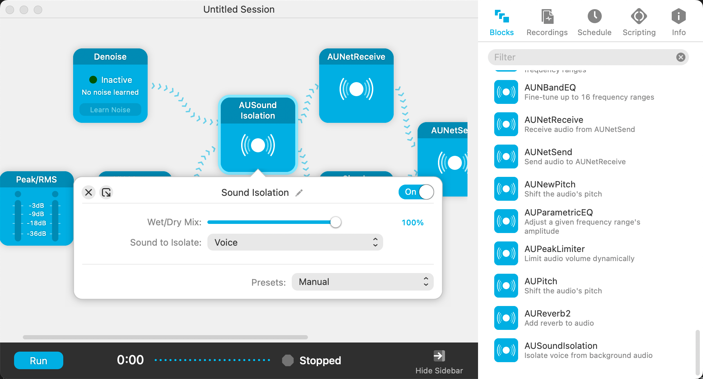

mac 上实现 RTX-Voice 效果，mac 语音隔离，降噪工具，怎么实现 NVIDIA Broadcast 降噪，人声隔离

找了很久这种工具

因为 mac 新版自带了一个 Voice Isolation，但是在 chrome 里面没法用，所以想找其他工具替代

最开始只找到了 Krisp，但是需要付费，不太想用。

后面想想能不能在 OBS 里面用，然后再用音频跳线搞出来，后面证明是可以的

1. 就是在 OBS 里面添加系统麦克风，
2. 然后再 mac 状态栏选择 `Voice Isolation`，
3. 然后 OBS 还需要安装一个 `Audio Monitor` 的插件，选择监听设备为 `Loopback/VB-Cable` 创建的虚拟麦克风就行了。(也可以选择直接用 OBS 的监听)
4. chrome 修改默认麦克风为虚拟麦克风

之前是在这里都打止了，但是也有陆续在找更好用的方案，开源的方案。

后来了解到有个 RNNoise 的机器学习效果好像还行，但是还是打不过 RTX Voice

其中有个 [GitHub 仓库](https://github.com/LeXuanKhanh/noise-suppression-for-voice/tree/macos-instruction?tab=readme-ov-file#macos) 提供了 VST 的功能，可以用在 OBS 加 VST 插件降噪，算是找到了开源方案

后面继续搜索，又看到 Audio Hijack 他们家有一篇[文章](https://rogueamoeba.com/support/knowledgebase/?showArticle=MicEffects&product=audiohijack)联合 Loopback 一起用的，感觉可能方便一些，就再试了一下，在找 vst 效果里面可以找到这个插件 `RNNoise suppression for voice`

找着找着，每个效果都仔细看了下，这下发现一个超好用的，**可以直接加载系统提供的 `Audio Uint Effets` 其中里面就包含了 `AUSoundlsolation`，其实就是状态栏我们选择的 Voice Isolation 功能的模块

其实之前有用到同样是 Loopback 家的 Audio Hijack 但是当时只是用来录制系统音频。没太注意看每个功能，结果错过了哎。

甚至还可以调节干湿！！！

可以 `AUSoundIsolation` 和 `RNNoise` 一起用，实测先 A 再 R 效果最好，堪比 RTX Voice，直接杀死比赛。

A 选择高质量，R 设置 VAD 阈值为 `0.95`

还可以加个 `Magic Boost` 声音小的话可以提上来，最后输出前建议再加个 `Gain Gate` 抑制最大声音 

实际上我注意到 SoundSource 也是支持这功能的，参考: https://weblog.rogueamoeba.com/2023/05/23/get-soundsource-5-6-now/

PR 也有的，https://www.reddit.com/r/premiere/comments/18tyti0/sound_isolation_better_than_speech_enhance/

相关文档应该在这里: [System-Supplied Audio Units in OS X](https://developer.apple.com/library/archive/documentation/MusicAudio/Conceptual/CoreAudioOverview/SystemAudioUnits/SystemAudioUnits.html)，但是可能有些落后，没有覆盖到 isolation

相关 API 介绍: [QuietNow](https://github.com/spotlightishere/QuietNow)

### Reference
- [Enhancing microphone input with audio effects](https://rogueamoeba.com/support/knowledgebase/?showArticle=MicEffects&product=audiohijack)
- https://github.com/LeXuanKhanh/noise-suppression-for-voice/tree/macos-instruction?tab=readme-ov-file#macos
- [Rogue Amoeba's Tools Gave Me Real Time Sound Isolation Everywhere. Even OBS.](https://reviews.ofb.biz/safari/article/1091.html)
- https://weblog.rogueamoeba.com/2023/05/23/get-soundsource-5-6-now/