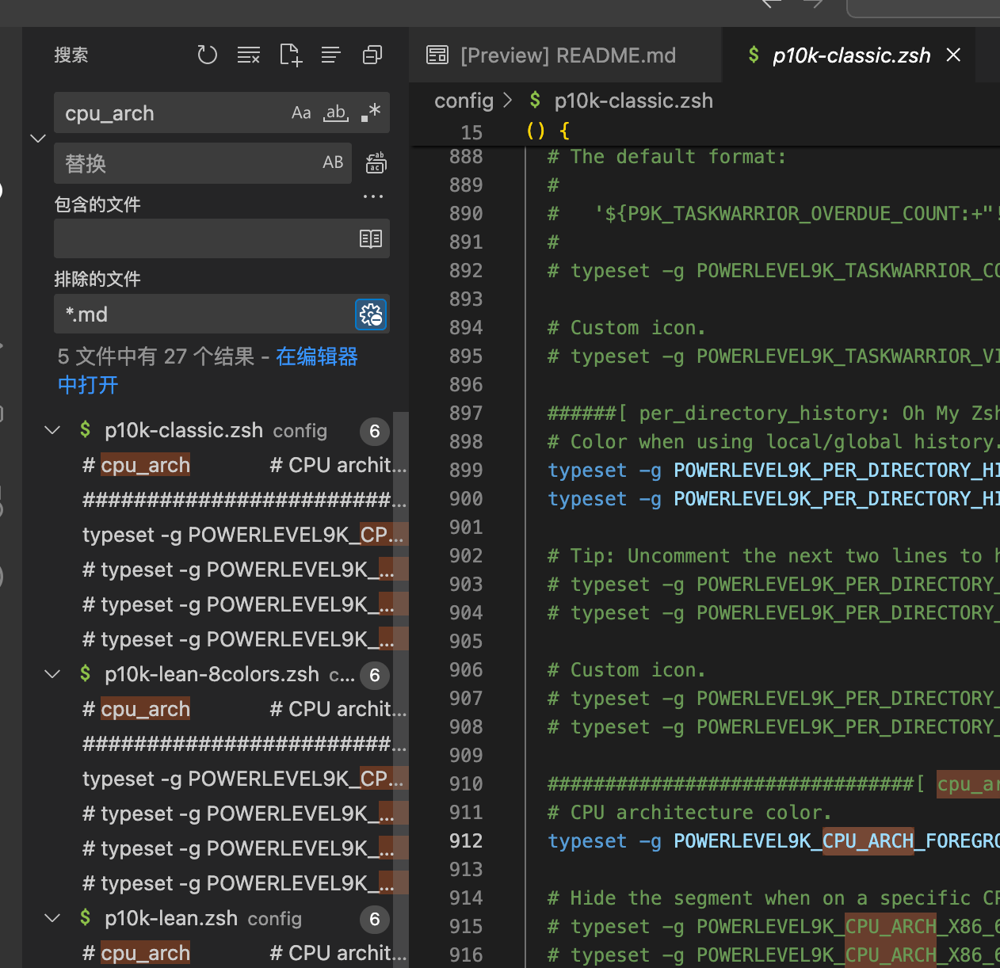
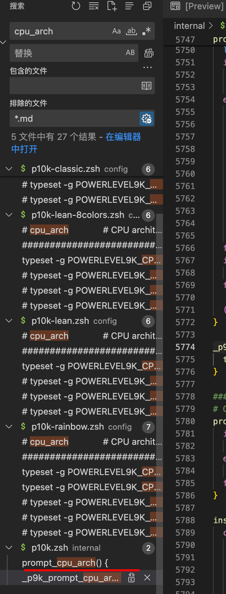
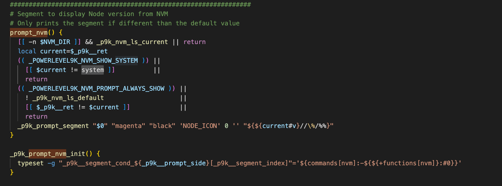

## 病因
`~/.nvm/versions/node` 下面的目录不能是软链接
```shell
[~/.nvm/versions/node]❯ l                                                               
total 0
drwxr-xr-x  10 admin  staff   320B  6  7 18:01 .
drwxr-xr-x   3 admin  staff    96B  4 25 16:07 ..
drwxr-xr-x   6 admin  staff   192B  6  7 16:53 v14.21.3
lrwxr-xr-x   1 admin  staff    45B  6  7 18:01 v14.21.999 -> /Users/admin/workspace/prebuild-node/v14.21.3
drwxr-xr-x   9 admin  staff   288B  5 21 12:34 v15.14.0
drwxr-xr-x   9 admin  staff   288B  4 30 14:37 v16.20.2
drwxr-xr-x   9 admin  staff   288B  4 30 14:37 v18.20.2
drwxr-xr-x   9 admin  staff   288B  4 30 14:36 v20.12.2
drwxr-xr-x   9 admin  staff   288B  5 16 02:41 v20.13.1
drwxr-xr-x   9 admin  staff   288B  6  6 23:29 v20.14.0
```

## 解决方法
把对应的构建后文件复制过来

注意，复制之后 `bin` 目录下面的软链接会丢失，要重新手动链接

## 问题定位
**目标**：找到显示 nvm 版本号的源码

先从官方文档入手，发现右侧显示信息是可以配置的，https://github.com/romkatv/powerlevel10k?tab=readme-ov-file#batteries-included

于是打开 p10k 源码，直接搜索大法，找几个名字长一些比较有个性的配置项

我选 `cpu_arch` 搜索出来有 27 个结果



然后一个个观察，发现最后两个函数比较可疑



`prompt_cpu_arch` 比较像是显示的

接着在这个文件里面继续搜索 `nvm` 相关

找葫芦画瓢，改成 `prompt_nvm` 搜一下看看



好家伙这一下就看到一个叫 `system` 的字样

```shell
prompt_nvm() {
  [[ -n $NVM_DIR ]] && _p9k_nvm_ls_current || return
  local current=$_p9k__ret
  (( _POWERLEVEL9K_NVM_SHOW_SYSTEM )) ||
    [[ $current != system ]]          ||
    return
  (( _POWERLEVEL9K_NVM_PROMPT_ALWAYS_SHOW )) ||
    ! _p9k_nvm_ls_default                    ||
    [[ $_p9k__ret != $current ]]             ||
    return
  _p9k_prompt_segment "$0" "magenta" "black" 'NODE_ICON' 0 '' "${${current#v}//\%/%%}"
}
```

由此可知，`system` 是 `$current` 变量的一个值，通过调用 `_p9k_nvm_ls_current` 的返回

继续搜索 `_p9k_nvm_ls_current`

```shell
# The same as `nvm_version current` but faster.
_p9k_nvm_ls_current() {
  local node_path=${commands[node]:A}
  [[ -n $node_path ]] || return

  local nvm_dir=${NVM_DIR:A}
  if [[ -n $nvm_dir && $node_path == $nvm_dir/versions/io.js/* ]]; then
    _p9k_cached_cmd 0 '' iojs --version || return
    _p9k__ret=iojs-v${_p9k__ret#v}
  elif [[ -n $nvm_dir && $node_path == $nvm_dir/* ]]; then
    _p9k_cached_cmd 0 '' node --version || return
    _p9k__ret=v${_p9k__ret#v}
  else
    _p9k__ret=system
  fi
}
```

一个个条件看了下 `$nvm_dir/versions/io.js/*` 我的 nvm 好像没得这个文件应该不是，而且也没看到过 prompt 显示 `iojs-v14.23.4` 这种版本号

应该是下面这个 `p9k__ret=v${_p9k__ret#v}`

一看判断调节，这下真相大白了 `$node_path == $nvm_dir/*`

> `local node_path=${commands[node]:A}`
> 这个修饰符 `A` 是获取真实路径的

原来是判断了 node 的真实路径和 NVM_DIR 环境变量是否前缀匹配

我这里是从其他目录 ln -s 过去的，肯定走不通这条判断

遂重新 `./configure --prefix=` 到 nvm 的目录下面

done