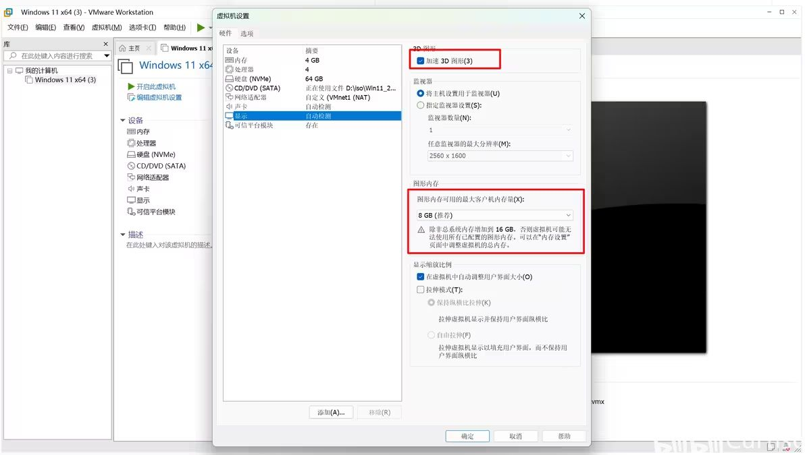
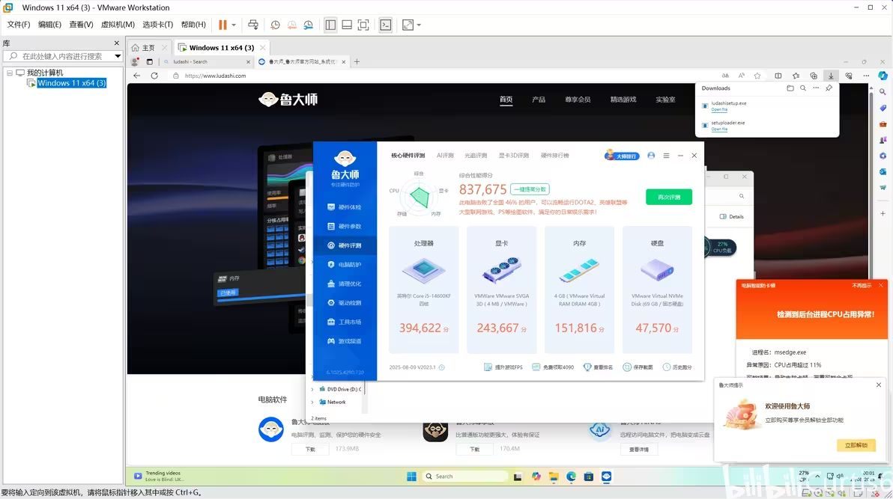
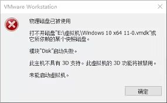
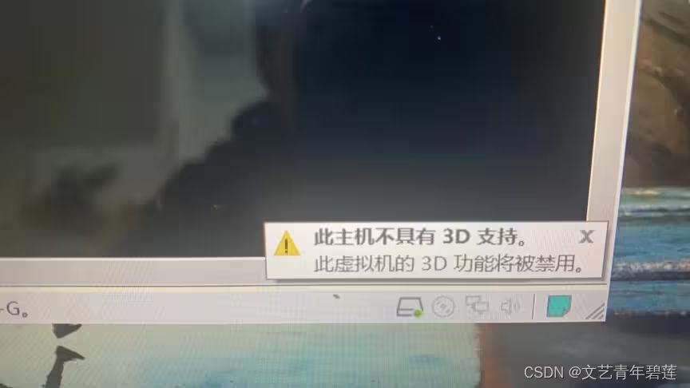
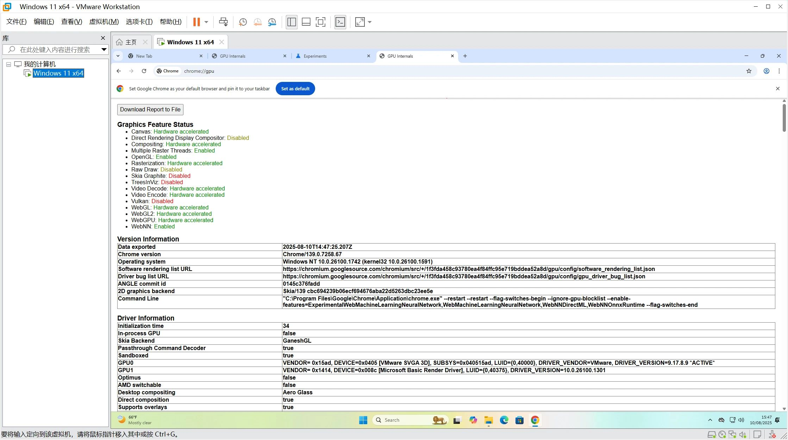
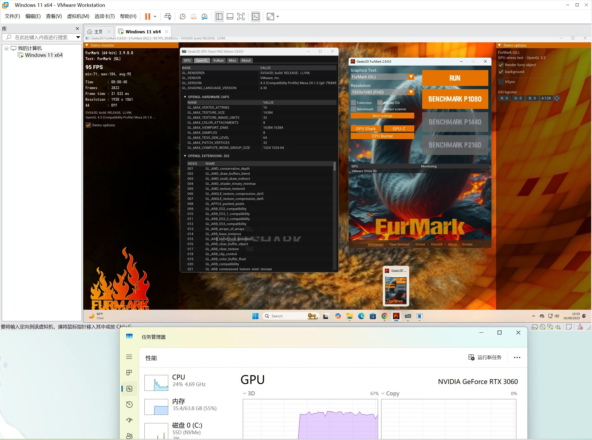
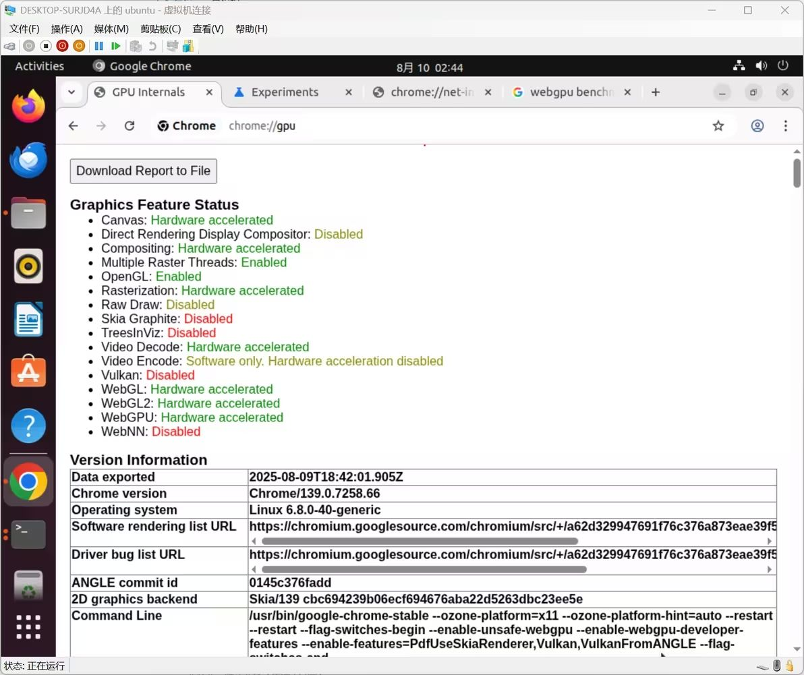

## vmware 3D 加速
没啥好说的其实，官方就支持，「加速 3D 图形」打开就行了，不过可能就卡在打开这一步，有时候会抽风，就得手动改配置

官方文档：https://techdocs.broadcom.com/cn/zh-cn/vmware-cis/desktop-hypervisors/workstation-pro/17-0/using-vmware-workstation-pro/configuring-and-managing-virtual-machines/configure-display-settings-for-a-virtual-machine.html

但是也有局限性，这玩意只是 API 层面的代理/转发，只能加速 D3D11_1 以及以下的。

无法支持 vulkan 或者 DirectML 或者 Tensor Core（不知道改了显卡id之后打驱动能不能用，🤔感觉多半应该是不行，没法操作对应的pci）。

如果有 ML 负载诉求可以转战 WSL，如果有更定制化的需求转战 hyperv 的 GPU-PV，原理也差不多也是套娃代理转发但是支持了 vulkan 和 libcuda，可以支持 linux 下使用 mesa 渲染各种3D加速以及 VA-API 卸载

有可能抽风的时候显示「此主机不具有 3D 支持」

官方 issue「VMware Workstation 17 播放器不支持主机的 3D 功能」：https://community.broadcom.com/communities/community-home/digestviewer/viewthread?GroupId=7171&MessageKey=9cd95e23-8615-4390-95c9-12548404736e&CommunityKey=fb707ac3-9412-4fad-b7af-018f5da56d9f

就得改改配置文件了

确保有「mks.enable3d = "TRUE"」，然后把「vmotion.svga」开头的都删了，再开机会自己生成「vmotion.svga」开头的，包括会自动加上「vmotion.svga.supports3D = "1"」

然后就ok了

对于 chromium 内核无法使用硬件渲染加速的问题「VMware Player hardware acceleration unavailable」：https://community.broadcom.com/vmware-cloud-foundation/discussion/vmware-player-hardware-acceleration-unavailable

> 虚拟机无法识别主机显卡。它只有一个带有 VMware 供应商 ID 的虚拟 GPU。VMware 软件会利用主机 GPU 在虚拟机内部提供 DX11/OpenGL 功能。对于您的情况，您应该使用 nvidia-smi 命令行工具看到 mksSandbox.exe 进程在 Nvidia GPU 上运行。 我通常不会在虚拟机上安装 Chrome。我在 OpenSUSE Tumbleweed 虚拟机上安装了 Chrome（版本 123.0.6312.105）。看起来 3D 加速被禁用了，但 ANGLE 图形选项与 Windows 上的 Chrome（版本 123.0.6312.106）不同。OpenSUSE 上的 Chrome 有“默认 ANGLE Vulkan”和“ANGLE 的 Vulkan”。但 VMware 虚拟机（无论是 Linux 还是 Windows）都没有 Vulkan 功能。 对于 OpenSUSE Tumbleweed（可能适用于任何 Linux VM），请转到 chrome://flags 选中“Override software rendering list”并将其设置为“启用”，chrome://gpu 将显示硬件加速已开启。Windows 上的 Chrome 和 MS Edge 也有相同的设置。

## hyper-v GPU-PV
hyperv 那个 GPU-PV 其实就是 WDDM 2.4 里面的「GPU paravirtualization」

MSFT GPU-PV 文档：https://learn.microsoft.com/en-us/windows-hardware/drivers/display/gpu-paravirtualization

VA-API 加速「Video acceleration API (VA-API) now available on Windows!」：https://devblogs.microsoft.com/directx/video-acceleration-api-va-api-now-available-on-windows/

VA-API 加速「D3D12 GPU Video acceleration in the Windows Subsystem for Linux now available!」：https://devblogs.microsoft.com/commandline/d3d12-gpu-video-acceleration-in-the-windows-subsystem-for-linux-now-available/

Linux 上的 DirectX 虚拟设备和驱动「DirectX is coming to the Windows Subsystem for Linux」：https://devblogs.microsoft.com/directx/directx-heart-linux/

工具「NanaBox」：https://github.com/M2Team/NanaBox

pwsh 脚本工具「oneclick-gpu-pv」：https://github.com/eric-gitta-moore/oneclick-gpu-pv

补充：「DirectX 11 现已通过 VMware Workstation 技术预览版 20H2 进行测试」：https://blogs.vmware.com/cloud-foundation/2020/05/18/directx-11-now-with-workstation-tp20h2/
