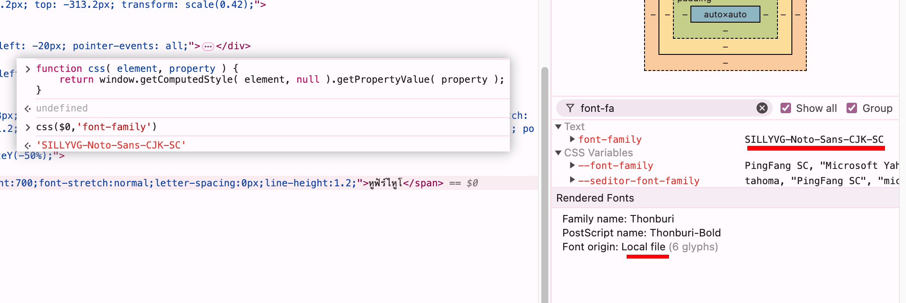

## 目的


## 尝试方式

### 计算样式 getComputedStyle
> ref: https://stackoverflow.com/a/7444724

```js
function css( element, property ) {
    return window.getComputedStyle( element, null ).getPropertyValue( property );
}
```

只能获取到计算后的 font-family 有哪些，并无法得知实际使用的字体



### FontFaceSet.prototype.check

### Canvas 绘制+逐字对比


### Chrome DevTools Protocol


## 结论


## 参考
- https://stackoverflow.com/questions/57853292/how-to-get-the-rendered-font-in-javascript
- https://stackoverflow.com/questions/7444451/how-to-get-the-actual-rendered-font-when-its-not-defined-in-css